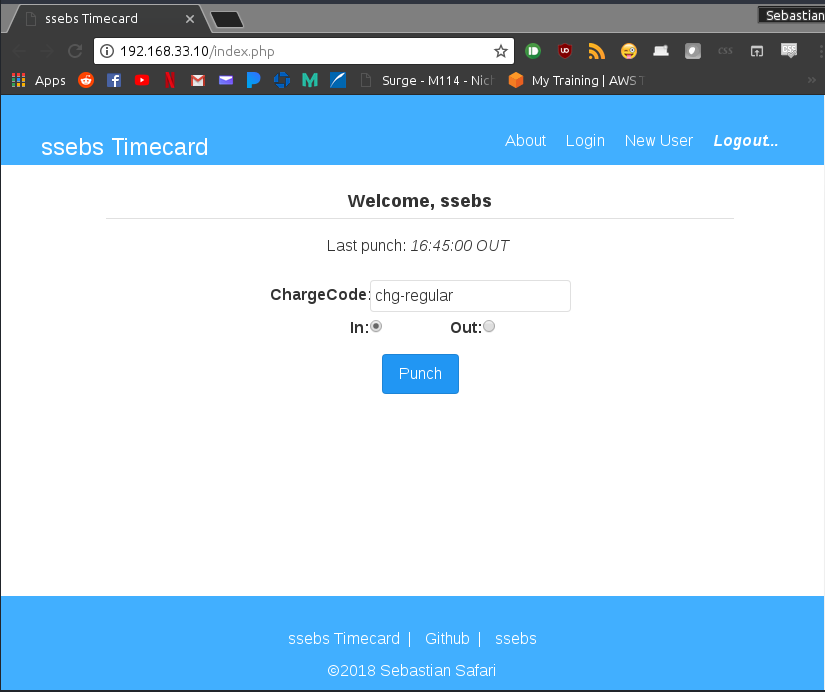

# timecard

Timecard php/mysql application

### Features include:

- Users - creation, login, passwords (plaintext)
- Basic Punching in and out, with charge codes (regular, sick, etc)
- Reporting (to come soon)

### Prerequisits to install:

- If you're using Vagrant:
    - See this repo: https://github.com/ssebs/timecard-vagrant
- If you're not:
    - Setup a webserver (apache, nginx, IIS)
        - Make sure this webserver supports php
    - Setup a mysql database 
        - Basic Credentials are stored in *connect.php*
        - See *_scripts/setup-db.sh* to setup the database
            - Note: credentials are same as in *connect.php*

### Usage:

- Follow prerequisites and make sure SQL connection will be valid.
- Clone this repo in your web server directory
- Serve the webapp and go to it in a browser
- Click "New User" at the top and Create yourself a new user
    - Note: password will be stored in plaintext\*, so don't use a real password if you want to be safe
- Login using this new account
- Punch in to start the clock!
- Punch out when you're done
- You can view how many hours you've worked with the reporting feature\*

> TODO: \*Reporting feature still to come

> TODO \*Passwords should not be stored in plaintext, planning on fixing that soon. (see https://stackoverflow.com/questions/4795385/how-do-you-use-bcrypt-for-hashing-passwords-in-php)

Screenshot below:

